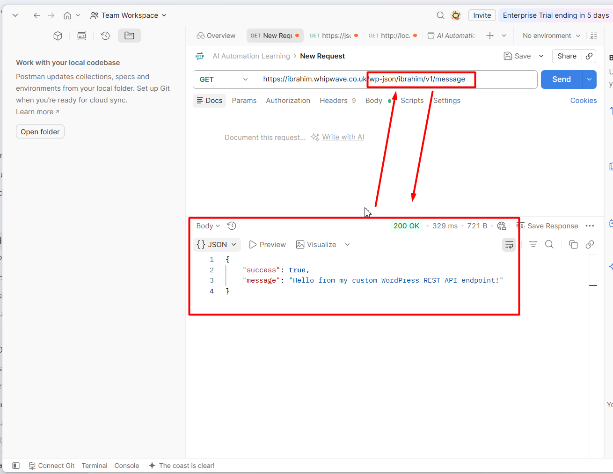

# Example 01 – Custom WordPress REST API Endpoint

## Overview

This example demonstrates how to create a custom REST API endpoint in WordPress using PHP.

Instead of using only the default WordPress REST API routes, we will register our own custom endpoint.

## Endpoint

```text
/wp-json/ibrahim/v1/message
```

## Request Method

```text
GET
```

## Expected JSON Response

```json
{
  "success": true,
  "message": "Hello from my custom WordPress REST API endpoint!"
}
```

## How It Works

WordPress provides the `rest_api_init` action for registering REST API routes.

We will use:

- `add_action()`
- `register_rest_route()`
- A custom callback function
- `WP_REST_Response`

## Example Structure

```text
01-custom-rest-endpoint/
├── README.md
└── custom-endpoint.php
```
## API Test Result

The custom REST API endpoint was tested successfully using Postman.

**Request**

```http
GET /wp-json/ibrahim/v1/message
```

**Result**

- HTTP Status: `200 OK`
- Response Format: `JSON`
- Endpoint successfully returned the expected response.

### Postman Test



## Purpose

The purpose of this example is to understand how a custom WordPress REST API endpoint is registered, how a GET request reaches WordPress, and how WordPress returns data as JSON.
